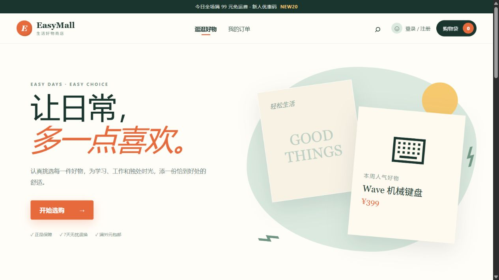
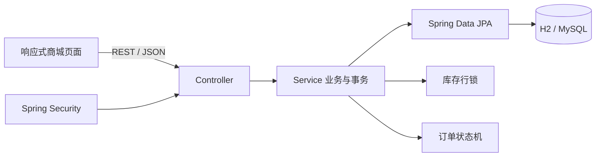

# EasyMall 电商系统

EasyMall 是基于 Java 17 和 Spring Boot 3.5 构建的单体电商系统，覆盖商品浏览、购物车、优惠结算、订单流转和运营管理等业务。应用采用前后端同包部署，默认使用 H2 快速启动，也可切换 MySQL 8 运行完整的数据库迁移、事务和索引方案。



## 项目概览

- 用户端提供注册登录、商品检索、购物车、优惠券结算和订单管理。
- 运营端提供经营数据概览、商品管理、订单查询和发货操作。
- 下单链路包含库存防超卖、重复请求幂等、订单状态机及超时库存补偿。
- 前端静态资源与后端一起构建为单个 JAR，同时支持 H2 和 MySQL 两种运行方式。

## 技术栈

| 模块 | 技术 |
| --- | --- |
| 后端 | Java 17、Spring Boot 3.5、Spring MVC |
| 权限 | Spring Security、BCrypt、Session、RBAC |
| 持久层 | Spring Data JPA、Hibernate |
| 数据库 | H2（默认）、MySQL 8.x、Flyway |
| 前端 | 原生 HTML、CSS、JavaScript，响应式单页界面 |
| 测试 | JUnit 5、AssertJ、MockMvc、H2 内存库 |

## 功能清单

- 用户：注册、登录、退出、用户/管理员角色隔离。
- 商品：分类、关键词搜索、价格/销量排序、分页、商品详情、库存与上下架状态。
- 购物车：添加、改数量、移除、金额实时汇总、库存前置校验。
- 营销：固定金额优惠、折扣优惠、门槛/有效期/总数量校验。
- 订单：下单、价格快照、优惠快照、30 分钟超时关闭、模拟支付、取消、发货、确认收货。
- 后台：经营数据概览、最近订单、订单发货、新增/修改商品 API。

## 核心亮点

### 1. 悲观锁防止库存超卖

结算事务使用 `PESSIMISTIC_WRITE` 锁定商品行，校验库存后再扣减；多个商品始终按商品 ID 排序加锁，降低死锁概率。并发测试让两个用户同时争抢最后一件库存，验证最终只有一个订单成功。

代码位置：`OrderService#checkout`、`ProductRepository`、`OversellConcurrencyTest`。

### 2. 幂等键防止重复下单

结算请求携带 `idempotencyKey`。同一用户重复提交时直接返回原订单，并使用 `(user_id, idempotency_key)` 数据库唯一约束作为并发兜底，避免因重复点击或网络重试生成多笔订单。

代码位置：`ShopOrder` 的联合唯一约束、`OrderService#checkout`。

### 3. 订单状态机与库存补偿

订单只允许 `待支付 → 已支付 → 已发货 → 已完成` 的正向流转；非法流转会被服务层拒绝。待支付或已支付订单取消时，库存与销量会在同一事务中回补，优惠券使用次数同步释放。

代码位置：`OrderStatus`、`OrderService#pay/cancel/ship/complete`。

### 4. 订单商品快照

订单项保存下单时的商品名、图标和价格，不依赖商品表的当前值。即使管理员之后修改商品价格，历史订单金额和展示仍保持一致。

代码位置：`OrderItem`、`OrderService#checkout`。

### 5. 超时关单与可验证性能

定时任务分页锁定超过支付期限的待支付订单，在同一事务中关闭订单、回补库存并释放优惠券；支付、取消、发货等写操作均锁定订单行，避免与关单任务竞争。项目使用 Flyway 管理表结构和索引，并在 MySQL 8.0.34 上完成 100 用户、20 并发的热点商品结算测试：100/100 成功，吞吐量 97.56 orders/s，P95 257 ms，最终库存为 0。

详细条件与边界见 [`docs/PERFORMANCE.md`](docs/PERFORMANCE.md) 和 [`docs/DATABASE.md`](docs/DATABASE.md)。

## 架构



代码按 `user`、`catalog`、`cart`、`coupon`、`order`、`admin` 业务域组织。每个业务域采用 Controller → Service → Repository 分层，业务事务集中在 Service 层维护。

## 快速启动

环境要求：JDK 17+、Maven 3.6.3+。

```bash
mvn spring-boot:run
```

打开 <http://localhost:8080>。

| 身份 | 用户名 | 密码 |
| --- | --- | --- |
| 普通用户 | `demo` | `demo123` |
| 管理员 | `admin` | `admin123` |

可用优惠码：`NEW20`（满 99 减 20）、`SAVE50`（满 299 减 50）、`ENJOY8`（满 499 享 8 折）。

默认数据保存在项目根目录的 `data/`，删除该目录即可重置示例数据。

## 使用 MySQL

```bash
docker compose up -d
mvn spring-boot:run -Dspring-boot.run.profiles=mysql
```

默认连接信息已与 `compose.yaml` 对齐，也可以通过 `DB_URL`、`DB_USERNAME`、`DB_PASSWORD` 环境变量覆盖。

## 测试与打包

```bash
mvn test
mvn clean package
java -jar target/easymall-1.0.0.jar
```

当前测试覆盖：

- 重复幂等键只扣一次库存、只生成一个订单。
- 订单非法状态跳转被拒绝，取消订单回补库存。
- 超时待支付订单自动关闭并回补库存。
- 两个并发用户争抢最后一件商品时不会超卖。
- 公共商品接口、登录保护和管理员 RBAC。

## 体验流程

1. 使用 `demo / demo123` 登录，搜索商品并加入购物车。
2. 结算时输入 `NEW20`，提交订单并点击模拟支付。
3. 退出后使用 `admin / admin123` 登录，在管理后台查看指标并发货。
4. 切回普通用户，在订单中心确认收货。
5. 查看订单状态从待支付、已支付、已发货到已完成的完整流转。

更多内容见 [`docs/API.md`](docs/API.md)、[`docs/DESIGN.md`](docs/DESIGN.md)、[`docs/DATABASE.md`](docs/DATABASE.md) 和 [`docs/PERFORMANCE.md`](docs/PERFORMANCE.md)。每次推送由 GitHub Actions 自动执行 6 个测试，并在 MySQL 8.4 服务上完成迁移启动检查。

## 实现边界

当前版本使用本地模拟支付和物流状态，商品视觉由 CSS 与字符图标呈现，未接入短信、对象存储和第三方支付。认证采用同源 Session，当前配置关闭 CSRF；部署到公网前需要补充 HTTPS、CSRF Token、验证码、接口限流和审计日志。
